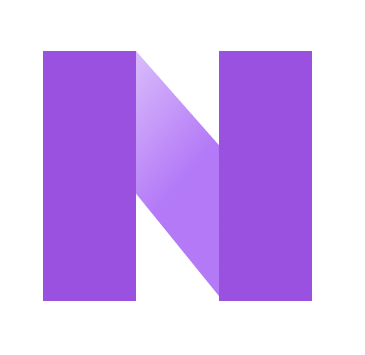

# Quick Notes

### 📋 About
  Quick notes is a simple note taking app buit on top of Node Js. It uses express and express-handlebars to create a dynamic app, and bootstrap for quick styling. Passport js creates a           google Oauth connection. And a mongoDB database is used to store data.

### 🚀 Built with
- Express
- Passport JS
- Mongoose
- Bootstrap

### 🎯 Goals from now
- Continuously improve UI and UX
- Recreate the project in Vue, to offer a better experience.
- Utilize Firebase and its modules to make a fast appliction.

### ♻️ Contributing
1. Fork this repository
2. Create a new branch with your feature name: `git checkout -b my-feature`
3. Work and commit your code: `git commit -m "my-feature or fix"`
4. Push to the forked repository and "compare and pull request"

### People who helped me:
- Traversy media node js video - the inspiration to this app.
- Vuka video on google Oauth.
